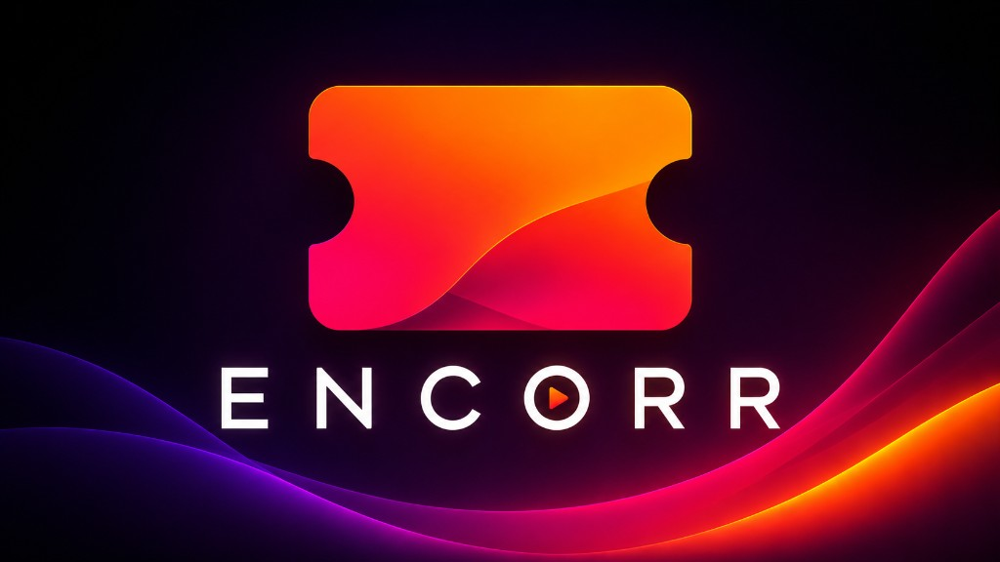

<p align="center">
  
</p>

# Encorr

Encorr is a native Plex and Jellyfin client with built-in **Seerr** support — browse your library, watch with a proper player, and request missing titles without opening a separate app or web dashboard.

This repository is a **work in progress**. There is no public website or release download yet.

This is a **vibe-coded** project — built for my own setup first, with a lot of hands-on iteration and real-device testing on actual TVs, phones, and desktops. AI helps move things along, but nothing here is fire-and-forget slop; features get used, broken, fixed, and refined until they feel right. If it ends up useful to anyone else, that's a bonus.

## Goal

The aim is a single cross-platform app (desktop, mobile, and TV) that handles the full media workflow:

- **Watch** — connect to Plex or Jellyfin, browse libraries, and play with a native Flutter client focused on playback quality
- **Discover** — continue watching, recommendations, cross-server search, Live TV, offline downloads, and the rest of the Plex/Jellyfin experience
- **Request** — integrate [Seerr](https://github.com/seerr-team/seerr) natively so you can browse trending titles, search for media you do not own, submit requests, and track status from inside the app

On top of that foundation, Encorr is pushing a **cinematic TV-first interface** — glass navigation panels, spotlight backdrops that follow focus, background trailers on detail pages, and D-pad navigation built for the couch rather than a browser tab.

## Built on Plezy

Encorr is built on top of **[Plezy](https://github.com/edde746/plezy)**, a native Plex and Jellyfin client for Flutter created by [edde746](https://github.com/edde746). Plezy provides the core playback engine, server connectivity, offline downloads, watch-together, tracker integrations, and multi-platform support that Encorr extends.

The main additions in this repo are:

- Native **Seerr** tab, search integration, and request actions on library detail pages
- **Glass morphism** UI chrome with a performance-aware fallback on low-end TV hardware
- **TV spotlight** layouts and trailer playback on detail screens

## Status

| | |
| --- | --- |
| **Website** | Not available yet |
| **Downloads** | Not available yet |
| **Seerr integration** | In development |
| **Platforms** | Windows, macOS, Linux, iOS, Android, Android TV, Apple TV (inherited from Plezy) |

## Development

Requires Flutter 3.44.0+ and a Plex account or Jellyfin server. To connect Seerr during development, you will also need a running Seerr instance and a Plex account linked in the app.

```bash
flutter pub get
scripts/codegen.sh
flutter run
```

See [CONTRIBUTING.md](CONTRIBUTING.md) for formatting, tests, and contribution guidelines.

## License

Encorr inherits Plezy's [GPL-3.0](LICENSE) license.

## Acknowledgments

- [Plezy](https://github.com/edde746/plezy) by [edde746](https://github.com/edde746) — the foundation this project is built on
- [Plex](https://www.plex.tv) and [Jellyfin](https://jellyfin.org) — media server backends
- [Seerr](https://github.com/seerr-team/seerr) — media request management
